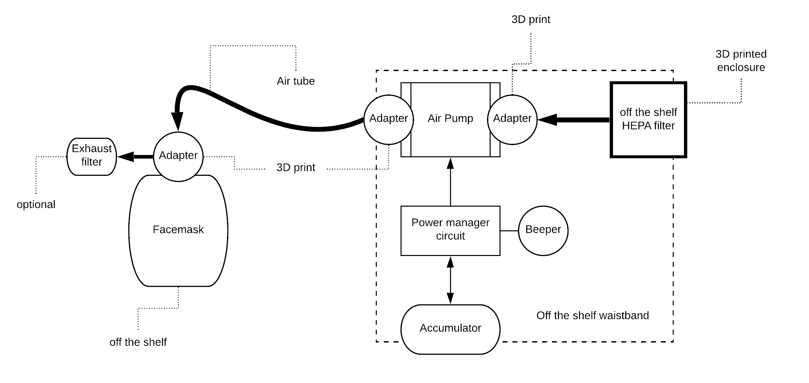
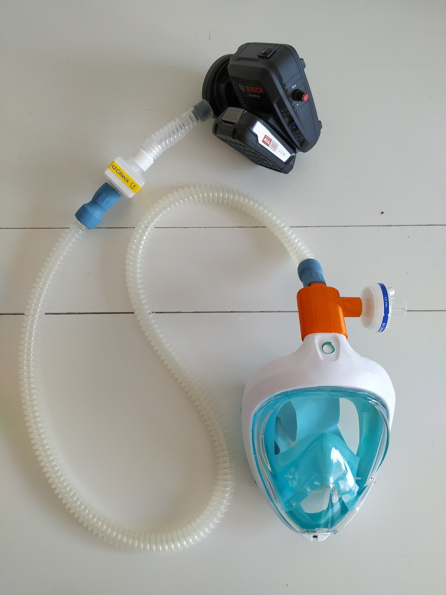
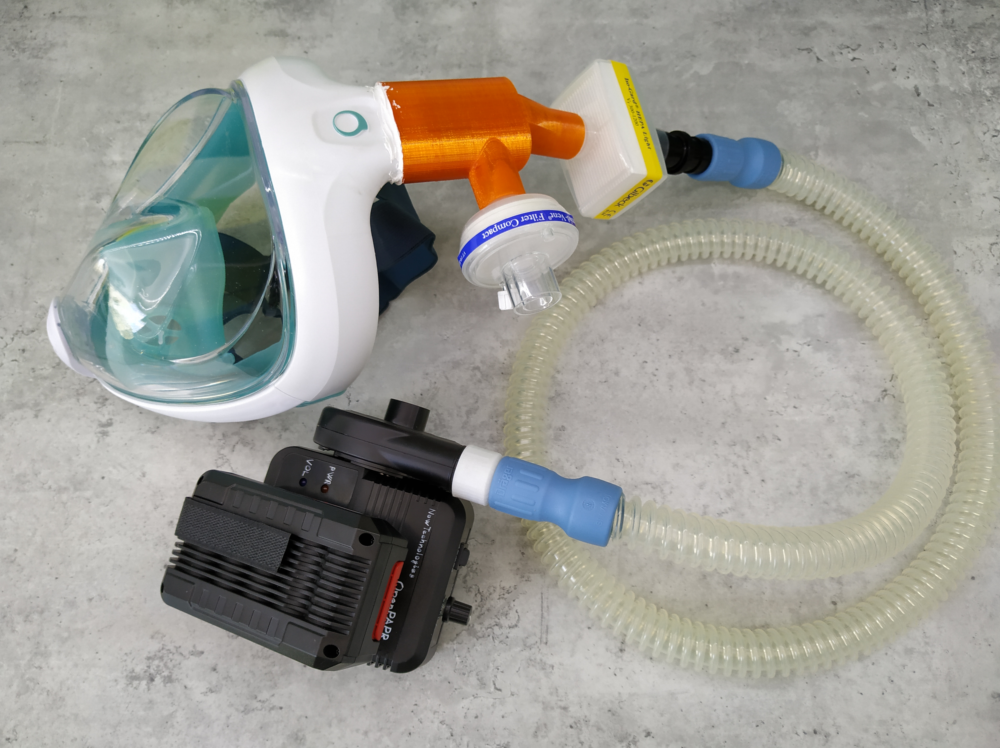

# Open Design PAPR 

Powered Air Purifying Respirator

### About (HUN)

Az OpenPAPR egy akkumulátoros üzemu, hordozható, motoros légtisztító légzokészülék, amely elsosorban egészségügyi dolgozók védelmére szolgál fertozésveszélyes környezetben. A Covid-19 világjárvánnyá válásával megnehezült a védoeszközök, illetve alkatrészeik beszerzése. Ezt szeretnénk áthidalni ezzel a tervvel, és referencia megvalósítással, amelyhez a piacon még elérheto komponenseket választottunk. Ezek a kínálat változásával szabadon cserélhetoek hasonló komponensekre. A készülék szabadon utánépítheto az aktuálisan elérheto alkatrészekbol.
A vegyvédelmi, egészségügyi vagy búvár maszk légmentesen zár, ezáltal véd a közvetlen cseppfertozéstol. A szurok a be és a kilégzett levegot is szurik. Az elektromos légpumpa segíti a lélegzést, és enyhe túlnyomást biztosít a maszkban, ami segíti elkerülni a potenciálisan vírusokat tartalmazó levego beszívását.

### Block diagram

### Photos

